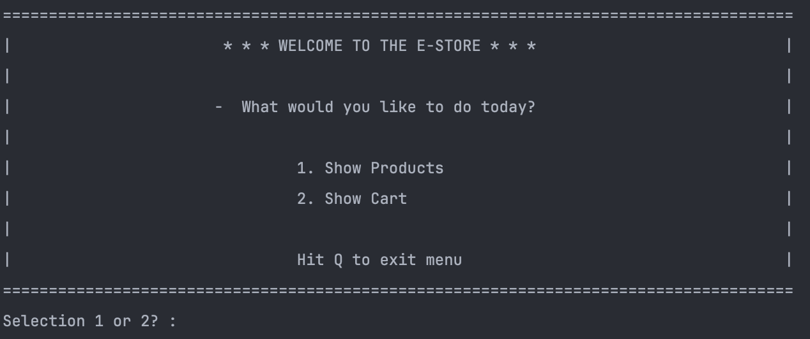
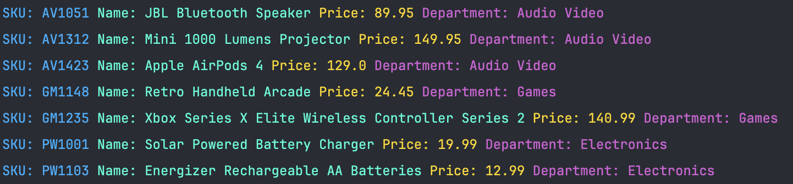
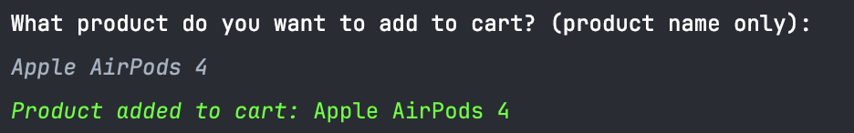
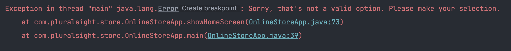

# Online Store

### A command-driven application that allows users to shop and purchase their products all through the terminal.



### Features
* Add products to cart 
* Remove products to cart
* Displaying sales receipt for products purchased

### Methods
`Show All Products`
```declarative
//Showing full list of products that the store sells
for (Product p: productsList) {
System.out.println("SKU: " + p.getSku() + " Name: " + p.getProductName() + " Price: " + p.getPrice() + " Department: " + p.getProductDepartment());
}
```


`Add Products to Cart`
```declarative
//Add product to cart
for (Product product : products) {
if (userInput.equalsIgnoreCase(product.getProductName()) && !userInput.isEmpty()) {
shoppingCart.add(product);

//Final output should be confirmation message to user about product being added to cart
System.out.println(successActionColor + italicText + "Product added to cart: " + resetText + product.getProductName());
}
}
```


`Remove Products From Cart`
```declarative
//Removing a product from cart
for (Product product : products) {
if (userInput.equalsIgnoreCase(product.getProductName()) && !userInput.isEmpty()) {
shoppingCart.remove(product);

//Final output should be confirmation message to user about product being removed from cart
System.out.println(successActionColor + "Product removed to cart: " + product.getProductName());
}
}
```


### Error Handling:

